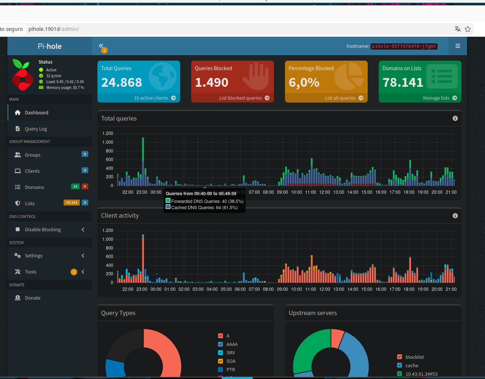
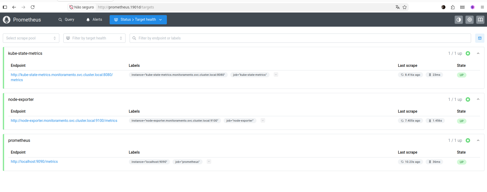
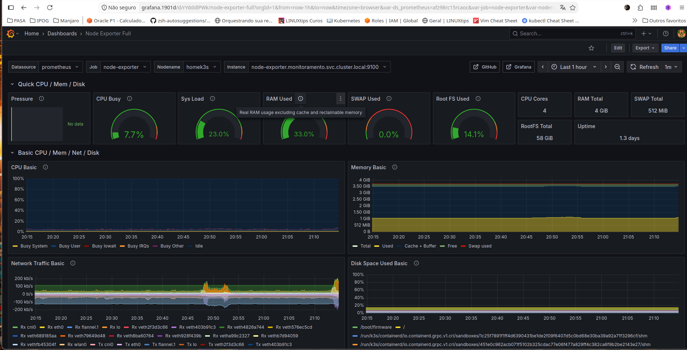
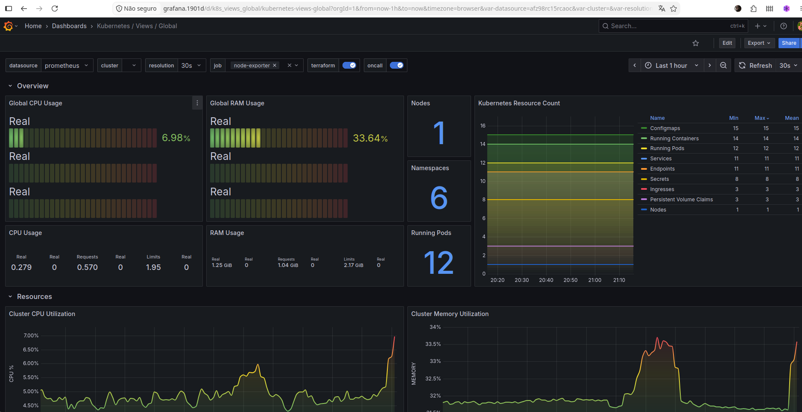

# Homelab DNS + Monitoramento

Projeto de laboratório utilizando Kubernetes (K3s) em um Raspberry Pi 4.

A ideia não foi simplesmente colocar aplicações para funcionar, mas ir entendendo cada componente da stack e montar tudo manualmente, por enquanto sem Helm pra evitar abstrações, reaprendendo o funcionamento de cada recurso do Kubernetes.

---

# Objetivos

- Ter um DNS local utilizando Pi-hole + Unbound
- Praticar Kubernetes
- Rever Deployments, Services, Ingresses e PVCs
- Utilizar manifests organizados por arquivos
- Criar uma stack de monitoramento com Prometheus e Grafana
- Utilizar Git para versionar toda a infraestrutura

---

# Hardware

- Raspberry Pi 4 Model B
- 4 GB RAM
- K3s

---

# Estrutura do repositório

Cada componente fica separado por diretório.

Dentro de cada pasta os YAML são numerados para facilitar a ordem de criação.

Exemplo:

```
00-namespace.yaml
01-secret.yaml
02-configmap.yaml
03-pvc.yaml
04-deployment.yaml
05-service.yaml
06-ingress.yaml
```

Assim basta executar:

```bash
k apply -f 00-namespace.yaml 
```
  Depois o 01, 02 e assim por diante


---

# Stack DNS

## Pi-hole

Responsável pelo bloqueio de anúncios e resolução DNS da rede interna.

Foi utilizado:

- Deployment
- PVC
- Secret
- Service LoadBalancer
- Ingress (Traefik)

Aprendizados:

- A senha precisa ser criada utilizando `printf` e não `echo`, caso contrário um `\n` entra na Secret e o login falha. (horas nisso)

Exemplo correto:

```bash
printf "MinhaSenha" > senha.txt
```

---

## Unbound

Servidor DNS recursivo utilizado pelo Pi-hole.

Foi configurado para:

- DNSSEC
- Cache
- Privacy
- QNAME minimisation
- Harden Glue
- Harden DNSSEC

O Pi-hole encaminha todas as consultas para o Unbound.

Fluxo:

Cliente envia requisição para pihole e ele repassa pro Unbound e de lá vai para os Root Server, assim dependo menos de DNS abertos

---

# Descobertas interessantes

## Clientes apareciam como 10.42.0.1

Inicialmente todos os clientes apareciam com o IP do cluster, assim eu não sabia quem era quem e não tinha como aplicar regras, foi necessário alterar o arquivo 07-pihole-service.yaml para usar o IP Local.

Problema:

```
externalTrafficPolicy: Cluster
```

Solução:

```
externalTrafficPolicy: Local
```

Depois disso o Pi-hole passou a identificar corretamente cada cliente.

---

# Monitoramento

A stack foi montada manualmente.

## Componentes

- Prometheus
- Node Exporter - Métricas de monitoramento do pi4
- kube-state-metrics - Métricas de monitoramento para K8S
- Grafana

Ainda sem Helm. 

O objetivo foi entender cada componente individualmente.

---

# Node Exporter

Instalado como DaemonSet.

Motivo: Daemonset faz todos os node do cluster receberem automaticamente um exporter.

Métricas disponíveis:

- CPU
- Memória
- Disco
- Filesystem
- Rede
- Load Average

Dashboard utilizado:

```
1860
Node Exporter Full
```

---

# Prometheus

Responsável por armazenar todas as métricas.

Aprendizados:

- ConfigMap contendo todos os scrape_configs.
- Alterações exigem:

```bash
kubectl rollout restart deployment prometheus -n monitoramento
```

Verificação:

```
Status → Targets
```

Todos os alvos devem aparecer como:

```
UP
```

---

# kube-state-metrics

Não coleta uso de CPU.

Ele consulta a API do Kubernetes.

Fornece informações sobre:

- Pods
- Deployments
- StatefulSets
- DaemonSets
- Nodes
- PVC
- Secrets
- Services

Aprendi que ele é diferente do node-exporter.

Node Exporter monitora o Linux.

kube-state-metrics monitora objetos do Kubernetes.

---

# Grafana

Conectado ao Prometheus.

Primeiros dashboards:

Node Exporter Full

ID:

```
1860
```

Kubernetes Views / Global

ID:

```
15757
```

---

# Organização

Cada aplicação possui:

- Namespace
- Deployment
- Service
- ConfigMap
- Secret
- PVC
- Ingress

Sempre separados em arquivos.

---

# Dicas!

- Namespace ajuda muito na organização.
- Service ClusterIP serve apenas dentro do cluster.
- LoadBalancer expõe serviços na rede local utilizando MetalLB.
- Ingress publica aplicações HTTP utilizando Traefik.
- Secrets são apenas Base64, não criptografia.
- ConfigMap serve para guardar configurações, depois monta nos deployments.
- PVC desacopla armazenamento do Pod.
- DaemonSet executa um Pod por Node.
- Deployment mantém a quantidade desejada de Pods.
- Prometheus não "descobre" aplicações sozinho. É necessário configurar os scrapes.
- node-exporter e kube-state-metrics possuem objetivos completamente diferentes.

---

# Executados até aqui:

- [x] Pi-hole
- [x] Unbound
- [x] Prometheus
- [x] Node Exporter
- [x] kube-state-metrics
- [x] Grafana
# Ainda quero colocar:
- [ ] Métricas do Kubelet / cAdvisor
- [ ] Exporter do Pi-hole
- [ ] Exporter do Unbound
- [ ] Loki
- [ ] Alertmanager
- [ ] Dashboards personalizados
- [ ] Backup dos PVCs

---

# Filosofia do projeto

Todo componente é instalado manualmente.

O objetivo não é apenas ter um ambiente funcionando, mas entender como cada recurso do Kubernetes se relaciona.

Preferi adicionar um componente por vez, testar e só então seguir para o próximo. Dessa forma, quando surgiram problemas, ficou mais fácil identificar a causa e ajustar.


## Screenshots

<table>
  <tr>
    <td align="center" width="50%">
      <a href="imagens/piholeprint.png">
        
      </a>
      <br>
      <b>Pi-hole Dashboard</b>
    </td>
    <td align="center" width="50%">
      <a href="imagens/prometheustargetsprint.png">
        
      </a>
      <br>
      <b>Prometheus Targets</b>
    </td>
  </tr>

  <tr>
    <td align="center" width="50%">
      <a href="imagens/nodeexporterprint.png">
        
      </a>
      <br>
      <b>Grafana - Node Exporter</b>
    </td>
    <td align="center" width="50%">
      <a href="imagens/k3sdashprint.png">
        
      </a>
      <br>
      <b>Grafana - Kubernetes</b>
    </td>
  </tr>
</table>